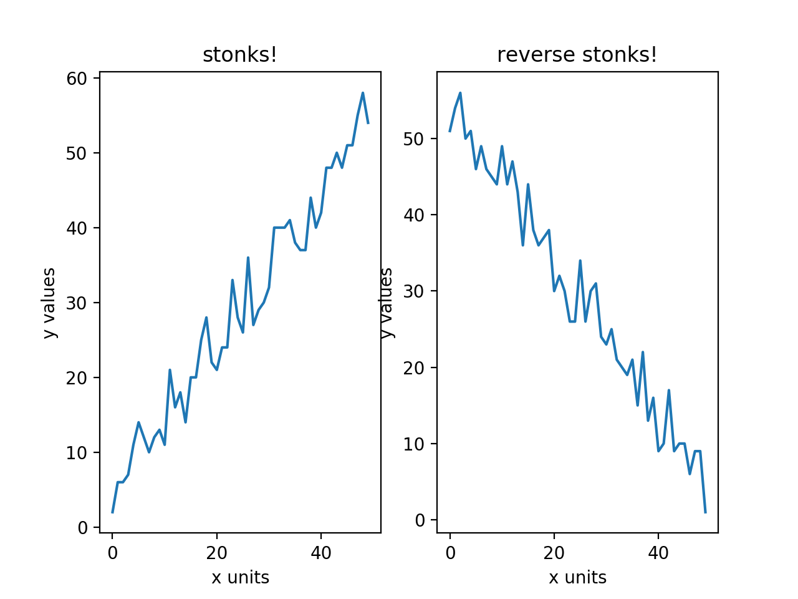
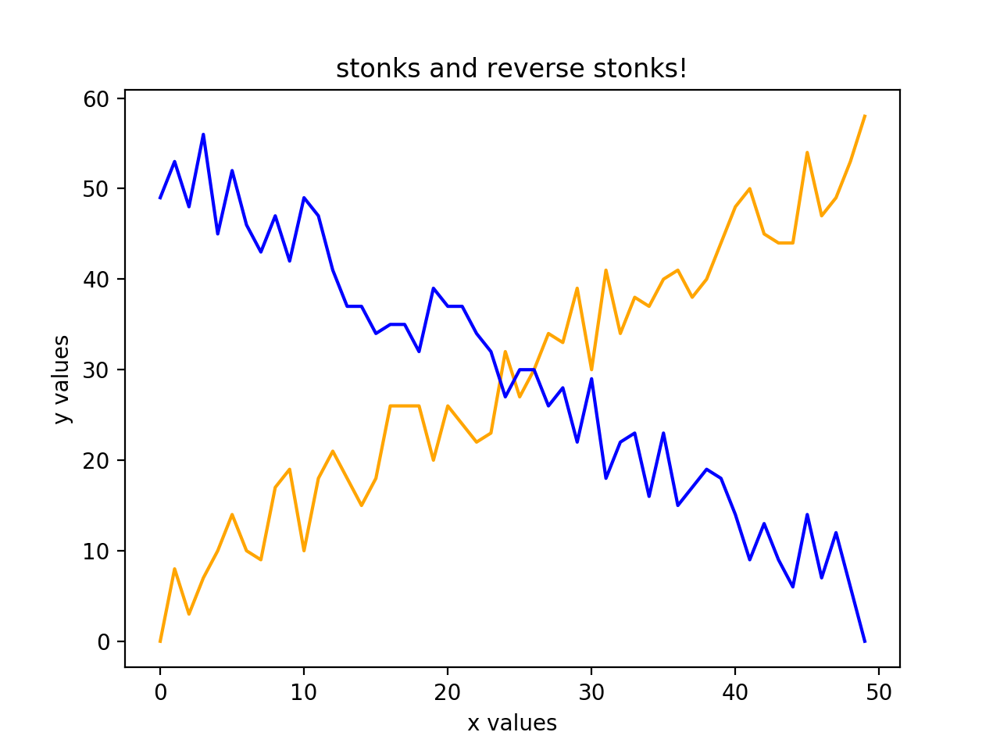

# Homework 6: Data Visualization!

## (80 points) Visualization Scenarios

------------------------------------------------------------------------------------------------------------

### Stage 1: Data Visualization in Data Exploration (30 points)

0. **Sample Aspect - Delete this**:
    - **Sample Question**: I want to analyze the relationship between stonks and reverse stonks.
    - **Graph & Analysis**: *Sample response - delete this*
        Here is my first graph to answer my question:
        

        In this graph, we see that stonks and reverse stonks can happen at the same time. Indeed, it can even
        happen in the same graph!
        

        It is really interesting how both stonks and reverse stonks lines have their ups and downs kinds of moments. Here, we see that there might be a direct negative relationship between the *stonks* line and the *reverse stonks* line - they are different by a factor of `-1`. Therefore, we can conclude that stonks can happen in both directions.

1. **Aspect One**:
    - **Question**: *Your question of choice here*
    - **Graph & Analysis**: *Your response here, with at least one graph*

2. **Aspect Two**:
    - **Question**: *Your question of choice here*
    - **Graph & Analysis**: *Your response here, with at least one graph*

3. **Aspect Three**:
    - **Question**: *Your question of choice here*
    - **Graph & Analysis**: *Your response here, with at least one graph*

------------------------------------------------------------------------------------------------------------

### Stage 2: Data Visualization for Model Exploration (30 points)

1. **Aspect One**:
    - **Question**: *Your question of choice here*
    - **Graph & Analysis**: *Your response here, with at least one graph*

2. **Aspect Two**:
    - **Question**: *Your question of choice here*
    - **Graph & Analysis**: *Your response here, with at least one graph*

3. **Aspect Three**:
    - **Question**: *Your question of choice here*
    - **Graph & Analysis**: *Your response here, with at least one graph*

------------------------------------------------------------------------------------------------------------

### Stage 3: Data Visualization for *SICK* Applications (20 points)

*Your geographic plot using Plotly goes here!*

------------------------------------------------------------------------------------------------------------

### Stage N: Extra credit plots (maximum +15 points, +5 points max for each aspect)
*Feel free to delete this section if you are planning to not implement extra credit*

------------------------------------------------------------------------------------------------------------

## (20 points) Socially Responsible Computing

1.
    - **Question**: (3 points) Please list at least three examples of accessible practices in data visualization.
    - **Answer**: *Your answer here*
                

2.
    - **Question**: (10 points) Evaluate the accessibility of the graphs that you produced. Please refer to the specific questions on the handout.
    - **Answer**:
        *Your answer here*

3.
    - **Question**: (7 points) Reflect on the stages of your design and implementation process. Please refer to the specific questions on the handout.
    - **Answer**:
        *Your answer here*

